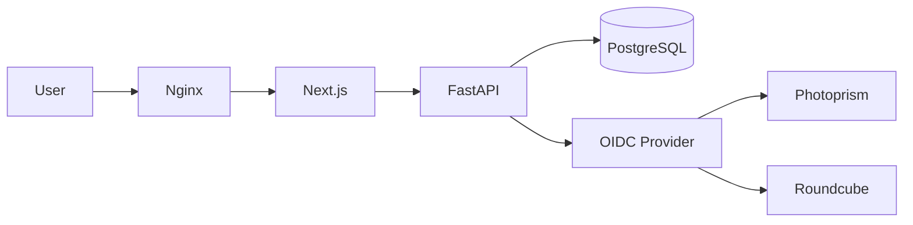
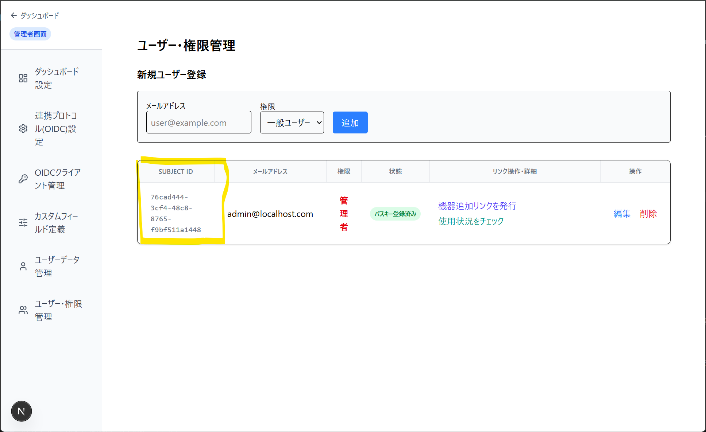

# SimpleAuth
シンプルに**パスキー(WebAuthn)だけで完結する、シングルサインオン(SSO)基盤**


## 🌟 コンセプト
「自宅サーバーやVPSで、自分や家族だけで使うツール群のログインに、いちいちパスワードを入力するのは煩雑です。
そこで『シングルサインオン(SSO)』が必要になりますが、企業向けのKeycloakなどの導入は設定難易度が高く、
個人利用にはハードルが高いのが現状です。」
そんな悩みを解決するためにSimpleAuthは生まれました。

FIDO2規格に基づいたWebAuthnを採用することで、**「パスワードを忘れた」「フィッシングに遭った」というリスクを排除しつつ、極めてスムーズなログイン体験**を提供します。


## ✨ 主な機能
- **Passkey Only**: パスワード入力なしの、指紋・顔認証・USBキーなどによる高速なログイン。
- **OIDC Provider**: 他のアプリケーション（Photoprism, Roundcube等）と連携するための標準プロトコルを提供。
- **Centralized Dashboard**: ログイン後、利用可能なサービスへのリンクをまとめたポータル画面を表示。
- **Device Management**: 認証端末の追加、削除をすることが可能。

## アーキテクチャ図


## 🛡️ セキュリティ設計
本プロジェクトでは、認証基盤として以下の安全策を採用しています。

- **WebAuthn (FIDO2) によるパスワードレス認証**: パスワードの代わりに生体認証や物理キー（Passkey）を用いることで、フィッシング攻撃やパスワード漏洩のリスクを根本から排除しつつ、高い利便性を実現します。
- **強制SSL/TLSによる通信保護**: WebAuthnの仕様に基づき、Nginxをリバースプロキシとして配置し、すべての通信をHTTPSで保護しています。
- **強固な署名アルゴリズム**: OIDC連携において、標準的かつ安全性の高いRS256（RSA-SHA256）を採用し、IDトークンの真正性を保証します。
- **シークレット管理の徹底**: 外部サービスとの接続に用いるシークレットキーやパスワードは、スクリプトによる乱数生成を行い、推測困難な値を生成します。


## 技術スタック
| カテゴリ | 技術 |
| --- | --- |
| Frontend | Next.js, TypeScript |
| Backend | Python (FastAPI)  |
| DB | PostgreSQL |
| Infrastructure | Docker, Nginx |

## 🚀 使い方（クイックスタート）
### 基本構成（SimpleAuthのみ）
```bash
docker compose up -d
```
### 拡張構成（Photoprism / Roundcube Mail連携あり）
```bash
docker compose -f docker-compose.yml -f docker-compose.override.extras.yml up -d
```
### 開発環境
```bash
docker compose -f docker-compose.yml -f docker-compose.override.dev.yml -f docker-compose.override.extras.yml up -d
```
#### 注意
拡張構成（extrasを含む）で起動した場合は、停止時も同じファイルを指定する必要があります。
```bash
docker compose -f docker-compose.yml -f docker-compose.override.extras.yml down
```
## ⚙️ セットアップ手順
### 1. 初期環境構築
1. **環境変数の準備**: `.env_sample` から `.env` を作成し、自身の環境に合わせて以下の項目を設定してください。
   - `SERVER_HOSTNAME`: 運用するドメイン（例: `sub.example.com`）
   - `BACKEND_BASE_URI`, `FRONTEND_BASE_URL`: ブラウザからアクセスする際のベースURL
   - ※これらの設定は、WebAuthnのRP IDやNginxのリバースプロキシ設定に反映されます。
   - `INITIAL_ADMIN_USER_EMAIL`,`INITIAL_ADMIN_USER_PASSWORD`: 初回管理者登録に使用する管理者登録用のメールアドレス、パスワードを設定。
   - **プロキシ構成に関する注意**: リバースプロキシ（Nginx等）を経由し、かつ `X-Forwarded-For` ヘッダーを用いてクライアントIPを正しく識別する必要がある場合は、`.env` 内の `TRUST_PROXY_HEADERS` と `TRUSTED_PROXY_IPS` を適切に設定してください。
2. **鍵の自動生成**: 次のスクリプトを実行します。出力されたパスワードやキー等の値を `.env` にコピーして貼り付けてください。
   ```bash
   ./backend/scripts/setup_env.sh
   ```
3. **SSL証明書の設定**: `infra/nginx/ssl/` 内に証明書を配置し、`.env` のパスを更新してください。
※証明書の取得方法（Let's Encrypt等）は任意ですが、WebAuthnの仕様上、HTTPS接続が必須となります。
### 2. 管理者登録
1. コンテナ起動後、以下のコマンドでログを確認します。"Initial admin user created with email:"が出力されていることを確認する。
   ```bash
   docker compose logs -f backend
   ```
   ```log
   simpleauth-backend  | 2026-07-13 00:03:03 [INFO] app: Initial admin user created with email: admin@localhost.com
   simpleauth-backend  | INFO:     Started server process [1]
   simpleauth-backend  | INFO:     Waiting for application startup.
   simpleauth-backend  | INFO:     Application startup complete.
   simpleauth-backend  | INFO:     Uvicorn running on http://0.0.0.0:8000 (Press CTRL+C to quit)
   ```
2. ブラウザーで以下のURLにアクセスし、`INITIAL_ADMIN_USER_EMAIL`,`INITIAL_ADMIN_USER_PASSWORD`に設定したメールアドレス、パスワードを入力し管理者登録を行う。※本ページはトップページアクセスすることは出来ません。
   https://your-domain/register-init
3. .envから`INITIAL_ADMIN_USER_EMAIL`,`INITIAL_ADMIN_USER_PASSWORD`を空文字("")に変更を推奨します。
### 3. 外部サービス連携（オプション）
#### Photoprism を連携する場合
1. 管理画面の「OIDCクライアント管理」から必要事項を入力し、保存します。
2. 生成されたシークレットキーを `.env` の `PHOTOPRISM_OIDC_CLIENT_SECRET` に貼り付けます。
3. 以下のコマンドでユーザーを実行します。
   - **sub**: ユーザ一覧・権限管理画面の「Subject ID」を使用します。
   - **username**: Photoprism側のユーザー名を指定します。
   
   ```bash
   docker compose exec photoprism users mod --auth=oidc --auth-id=[sub] [username]
   ```

#### Roundcube Mail を連携する場合
1. OIDCプラグインをインストールします。
   ```bash
   docker compose exec roundcubemail composer require cymdeveloppement/roundcube-new-oidc
   ```
2. 構成ファイル(roundcubemail:/var/www/html/plugins/roundcube_new_oidc/config.inc.php)を編集して、OIDCの接続情報を設定してください。

## ⚠️ 注意事項（重要）
**ローカル環境でのアクセスについて**
PhotoprismやRoundcube Mail等の外部サービスと連携する場合、`localhost` で直接アクセスすることはできません。OIDCリダイレクト処理においてドメイン不一致が発生するためです。
必ず **Nginxを介した固定IPまたは独自ドメイン（FQDN）** を利用してください。
**WebAuthnの要件**
WebAuthn（パスキー）を利用するため、**HTTPSによるSSL証明書の設定は必須**です。

## 🛠️ カスタマイズと拡張性
本プロジェクトは、コアとなる認証基盤と、外部連携サービスとの接続を分離した設計を採用しています。

- **柔軟なNginx構成**: 
  `nginx.conf` 内に定義されている `upstream` は、サンプルの外部サービス（Photoprism, Roundcube等）を想定していますが、**利用者は自身の環境に合わせてこれらの定義や `conf.d/` の内容を自由に書き換えることが可能**です。
- **ポートによる識別**: 
  サブドメインを用意できない環境でも動作するよう、あらかじめ特定のポート（2343, 9443等）でサービスを識別する構成を組み込んでいます。

## 💡 実装のこだわり（設計思想）
- **パスキーへの特化**: セキュリティと利便性の両立のため、WebAuthnを核とした設計を行っています。
- **拡張性の確保**: OIDCプロトコルに準拠することで、将来的に他のツールとの連携も容易に拡張可能です。
- **ハイブリッドな認証対応**: 外部アプリ向けの「OIDCプロトコル」と、リバースプロキシ等を通した際の「HTTPヘッダーによるユーザー識別（Proxy Auth）」の両方をサポートし、多様な構成に対応します。
- **シンプル**: 可能な限りシンプルで導入しやすい構成を目指しています。

## 🚀 Roadmap (今後の展望)
- [ ] フロントエンドのコンポーネント化を意識したリファクタリング
- [ ] UIの見易さ改善
- [ ]  **防御機能の強化**: ブルートフォース攻撃やDoS攻撃に対する防御のため、レート制限（Rate Limiting）および異常なアクセス検知ロジックの実装
- [ ] より高度な権限管理（RBAC）の実装

## AIの利活用について
GitHubCopilot/ローカルLLM Gemma4を使用しコード生成を実施しました。
コードは最終的にすべて作成者がレビューしております。
ロゴの作成にも、Copilotを使用しております。

## ライセンス
[MIT License](LICENSE)
